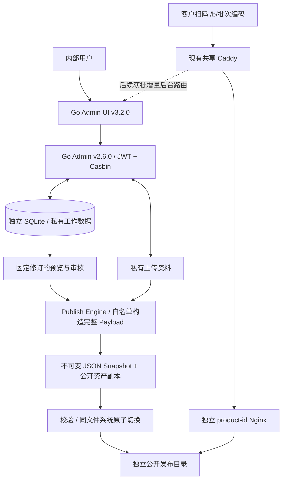

# T2 — Product Digital Identity 正式架构

日期：2026-09-07。状态：架构设计完成、等待人工确认；未进入 T3，不含正式表结构、DDL 或业务实现。数据库推荐独立 SQLite，版本依据见 [上游核验](GO_ADMIN_EVALUATION.md) 和 [数据库决策](DATABASE_DECISION.md)。

## 系统边界与数据流



UI 与后台服务于内部人员。公开端仍为 HTML/CSS/Vanilla JavaScript/JSON，只读已发布快照和公开静态资产，不调用后台公开 API，不查数据库，不把图片链接回后台上传服务。Admin/数据库/发布任务停止后，已经激活的快照、页面、图片由独立 Nginx 继续服务。

这一保证限于后台依赖断开：同宿主机、磁盘、Docker Engine、网络、Caddy 故障仍有共同风险，不能承诺同机绝对故障隔离。

## 与现有 POC 的关系

本轮冻结 `site/`。它是既有 POC，不是新后台的运行目录或可写发布目录。未来 T11 在独立 `public-site/` 建立正式静态入口，复用原有展示与样式思路，以完整 Published Payload 替换“批次 JSON + 可变产品 JSON”的读取依赖；保留原 site 和样例用于回归，不移走现有文件。

正式 `/b/{batch}` 保持稳定；Nginx 仅对此 HTML 入口提供有边界回退，缺失 JSON、图片等必须真实 404，不能一律返回 index.html。正式域名 `id.potahub.com`，测试域名 `id-test.potahub.com`。域名只是未来目标，本轮不解析、访问、切换 DNS 或修改 HTTPS；SSL 暂缓约束继续有效。

## 模板、批次与自定义内容

核心结构化字段 + 受控自定义值的混合设计。以下仅是 T3 输入，不是正式表设计：products、batches、inspection_items、certifications、media_assets、passport_versions、publish_records、audit_logs、custom_sections；模板版本/自定义字段定义的具体表划分留给 T3。

- 产品保存默认名称、原料、工艺、包装、储存、认证和说明。创建批次时固定所用产品模板修订并带入默认内容；推荐草稿也固定继承基线，产品后续变更通过显式“更新模板资料”及差异预览接纳。
- 批次覆盖包装、原料、工艺、认证、检测和其他展示内容；继承、覆盖、主动清空必须区分。数组应明确整体替换或按稳定条目覆盖，不能用模糊 deep merge；规则在 T3 确定。
- 批次修改不得反写产品。提交审核后冻结候选内容及其摘要，审核/发布绑定同一修订；修改内容则回 Draft、旧审核失效。发布时只解析该固定模板版本及批次覆盖，不能读取产品最新值改变审核结果。
- 检测项目为任意数量子项，至少 name/specification/result/unit/status/sort_order。产品/批次下的自定义模块支持标题、类型、值、顺序及公开控制；限定文本、键值、表格、受控资产等类型，不允许直接插入任意脚本或 HTML。
- 自定义字段定义和值由后台维护；新增普通检测项或模块不要求改 Go 代码/数据库列。核心批次编码、产品关联、状态、日期及修订控制保留结构化字段；不是所有业务都塞 JSON。
- 非技术流程：登录 → 批次身份证 → 新建 → 选产品 → 带入默认资料 → 填批次号/日期/检测 → 按需覆盖 → 预览 → 提交审核 → 发布。
- 复制上一批次只复制适合复用的工作资料，新建身份与 Draft，清除发布/审核元数据。必须提示修改批次号和日期；上一批检测结果不得静默继承为新批合格证据，默认清空结果并重置 NOT_TESTED，保留项目/规格结构。

## 权限与工作流

复用 Go Admin JWT、用户、角色、菜单、Casbin 路由/方法授权。API 授权加业务状态校验共同执行；菜单/按钮隐藏不是授权。公开端不携带后台 token。

| 角色 | 权限 |
| --- | --- |
| Super Admin | 所有系统与业务权限；用户/角色/权限/配置、受控删除、发布、回滚 |
| Editor | 创建/编辑产品与批次、上传、预览、提交审核；无正式发布或回滚权限 |
| Reviewer | 查看、审核、确认、驳回、正式发布；默认不授予用户配置、删除或回滚 |
| Viewer | 授权范围内只读；无编辑、上传、提交、发布 |

工作流：Draft → Pending Review → Published → Archived。Editor 提交；Reviewer 审核发布或驳回至 Draft；Super Admin 拥有所有权限。Archived 推荐由 Super Admin 管理，具体撤回公开展示政策在 T3 确认；归档不自动物理删除历史或使已印二维码失效。

发布失败不应标成成功 Published。已有 Published 需要修改时创建新的 Draft 修订，旧公开版本持续服务；新修订重新经过审核。编辑状态、发布作业状态、质量检测状态是不同维度，不能把 PASS 与 Published 混用。

## 发布与原子可见性

Publish Engine 是后台业务模块与可恢复执行器，首版可位于同一 Go 进程，不另引入认证体系或实时公开 API。数据库事务与文件系统 rename 不构成一个跨资源原子事务，必须单独设计可恢复的发布记录，不能仅写一句 atomic rename 就声称全部一致。

1. 事务内验证角色、审核状态、候选修订及幂等键；冻结输入、记录待发布版本/任务。网络和大文件处理在事务外执行。
2. 从固定模板、批次覆盖、检测、认证、自定义模块构造显式 Public DTO；用允许列表逐字段拣选，验证 Schema、业务规则及资源清单。
3. 审核允许公开的图片/证书生成独立副本，使用不可变或内容哈希路径。私有资料不直接挂到静态服务。历史图片不得原路径覆盖，否则 JSON 冻结也会失真。
4. 在目标公开文件系统的非公开 staging 中写临时文件，校验 JSON、大小、摘要、所有资源存在，刷盘并关闭；原子 rename 的源和目标必须同一文件系统。权限/磁盘满/跨盘错误时保持旧版本。
5. 保留不可变 `versions/{batch}/v{n}.json` 与资产；最后用一个原子操作替换稳定 `published/{batch}.json`（内容为完整快照），作为对客户可见的提交点。资产先就绪，避免多文件逐个覆盖导致新旧混用。页面只读取稳定完整快照，版本号写在 payload 中。
6. 发布执行器校验激活文件的摘要/版本后记录激活结果及审计。若文件已切换而数据库确认失败，恢复时根据已准备记录与文件摘要对账；重复任务幂等，不能多发版本或错误覆盖较新版本。

同批次发布/回滚必须串行，有修订前置条件，阻止晚到的旧任务覆盖新版本。稳定快照使用可控缓存再验证策略；不可变资源可长缓存。备份与回退要保留所引用的全部资产。

## 公开白名单与预览

允许公开的是产品公开身份、批次码、日期、公开说明、原料/工艺/包装、检测、批准的认证、经过允许的自定义模块和公开资产路径，以及公开版本元数据。具体 JSON Schema 与字段定义留 T3/T9。

禁止直接序列化 ORM 对象。用户信息、内部备注、成本、报价、客户资料、供应商敏感信息、审核意见、权限、数据库 ID、内部日志不得进入公开 DTO。自定义值同样受允许类型、公开标记及审核约束，不能用“这是 JSON”绕开白名单。

预览使用与发布相同的 Payload 构造和渲染器，但经登录授权，在私有预览区显示未发布水印；不能先将草稿放进公开目录再依赖 noindex 隐藏。公开快照中不包含发布人的内部用户信息，发布用户保存在私有历史记录中。

## 历史、回滚、审计

每次正式发布保留完整最终 Payload、版本号、摘要、发布时间、发布用户、备注；用户与内部备注只在私有库。模板变化不能修改历史 Payload，历史关联资产也不可变。

从 v3 回滚到 v2 时使用 v2 已冻结 Payload，不重新解析当前模板。建议创建新的激活/回滚记录并引用 v2，保留 v3 和原发布记录；按同一安全写入流程切换公开稳定快照，核对权限、目标批次及资产。回滚执行失败保持旧快照，不删除历史。明确区分内容版本与激活事件，最终模型留 T3。

业务审核、发布、回滚应保存可靠审计，不以框架异步访问日志替代。保留谁、何时、对象、动作、结果、关联修订/版本；敏感内容不进入通用请求日志。

## 推荐本地目录（未来创建，本轮仅 docs 已创建）

```text
/path/to/ID/
├── site/                              # 原 POC，冻结保留
├── tests/                             # 原静态回归
├── docs/                              # 本轮研究/决策/任务地图
├── admin/                             # T4 才创建
│   ├── go-admin/                      # 官方后端结构，保留 app/cmd/common/config
│   ├── go-admin-ui/                   # 官方 UI；与后端为相邻目录
│   └── deploy/                       # 项目专用本地 Compose/构建配置
├── public-site/                       # T11 正式静态入口及快照读取器
└── runtime/                           # 未来本地数据，排除版本库
    ├── admin/{data,uploads-private,logs,backups,preview}/
    └── public-test/{staging,versions,published,assets}/
```

后台保留两仓相邻布局，兼容上游工具的目录约定；本轮没有创建 admin、public-site、runtime 或写业务代码。正式工作数据、密钥、备份不能进入 Git 或公开目录。

## 未来服务器隔离（本轮绝不执行）

- `/opt/proxy` 保留既有共享 Caddy 项目；`/opt/directus` 和 Directus 数据不动。
- `/opt/passport-admin` 独立 Compose、稳定项目名 passport-admin、自有容器、SQLite data、私有上传、日志与备份。后台不开放宿主机公网业务端口，不用 privileged/host network/Docker socket。
- `/opt/product-id` 继续独立 Compose 和 Nginx。后台停止不带停公开容器；公开静态根只读挂载，不能位于后台容器可丢失层。
- 后台 UI 网关通过 edge 与 Caddy 通信，API 可在后台私有网络由 UI 网关转发；SQLite 无数据库网络。若启用 PostgreSQL，仅 DB 与 API 加入专有内部网络，DB 不接 edge。edge 名称/成员/现状尚未核验，共享网络不是访问控制边界。
- 发布执行器只允许写入数字身份证专用发布产物目录，公开 Nginx 只读访问；一般管理 HTTP 进程不获得 `/opt/product-id` 整个工程、配置或其他站点的写权限。精确卷路径与挂载边界在 T13 形成可审查配置后确认；不可借发布顺带更改共享 Caddy 挂载。
- 生产/测试分离数据、发布根、激活操作与权限，禁止测试按钮写生产。容器划分、容量预算、资源上限、进程数和日志轮转在 T13 实施前确认，128m/0.25 CPU 不能当作新后台已验证指标。
- 本轮不连接服务器，不检查 `/opt`。T13 获批后先只读核查实际 Compose/Caddyfile/网络，不索取 `.env` 或私钥。共享组件变更必须列出影响、验证、回退并获明确确认；不重建 Caddy、不覆盖 Caddyfile，不将后台加进 proxy 或 Directus Compose。
- T14 仍需独立确认 Caddy/DNS/HTTPS 和正式二维码，SSL 暂缓不会因写了任务表自动解除。先测试环境再生产，回归既有站点，失败只回退本项目。

T0–T2 到此结束；后续执行范围见 [TASKS.md](TASKS.md)。
