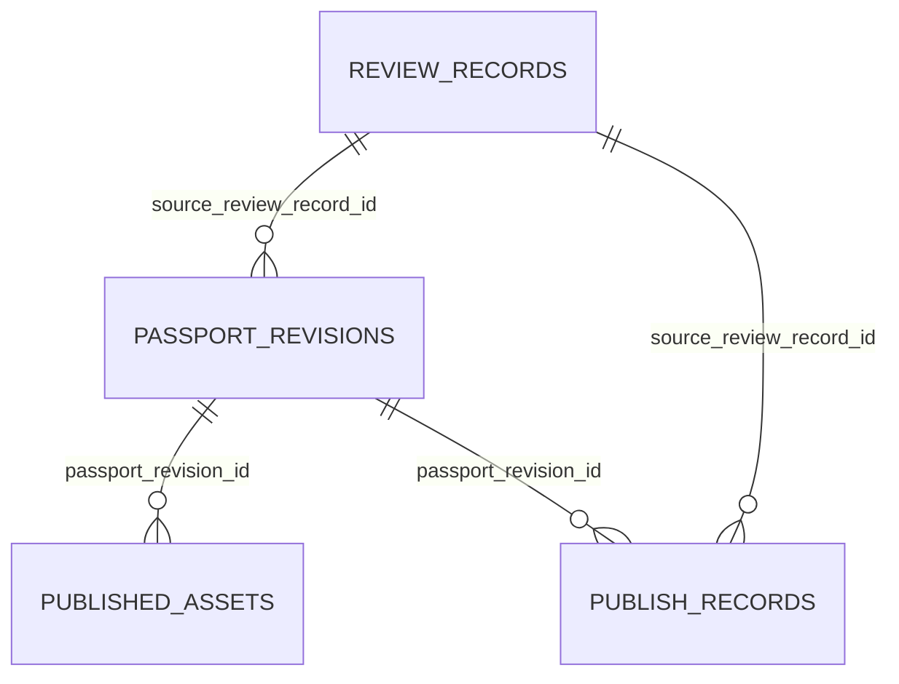
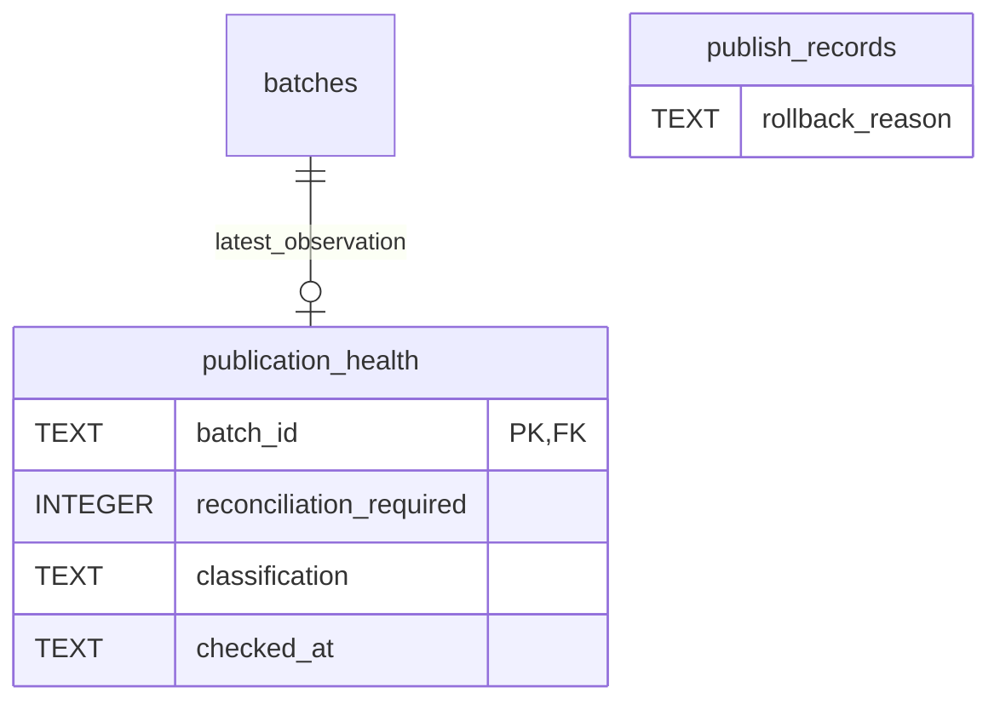

# T3 数据模型 ERD

> 当前 T10（2026-09-10）：T0–T9 已人工验收；版本、审计与回滚已本地实现并等待人工验收，详见本文末节及 T10_VERSION_AUDIT_ROLLBACK.md。下方早期阶段文字保留历史语境。

> T9 增量（2026-09-10）：T0–T8 已人工验收；T9 已本地实现，等待人工验收。下列早期状态保留为历史记录。

> T8 更新（2026-09-09）：T3–T7 已人工验收，以下关系图加入本轮 review_records；T8 等待人工验收。初始“未建表”说明为 T3 历史状态。

状态：**等待人工验收**。这是设计图，未创建任何表。字段、NULL、CHECK、外键及删除策略以 [DATA_MODEL.md](DATA_MODEL.md) 为准；图中只显示关系关键字段。

```mermaid
erDiagram
    products ||--o{ product_revisions : has
    products o|--o| product_revisions : selects_current
    products ||--o{ batches : identifies
    product_revisions ||--o{ product_revision_translations : translates
    product_revisions ||--o{ batches : fixes_base
    product_revisions o|--o{ product_revisions : copied_from
    batches o|--o{ batches : cloned_from
    batches ||--o{ batch_overrides : overrides
    batch_overrides ||--o{ batch_override_translations : translates
    media_assets o|--o{ batch_overrides : image_override
    batches ||--o{ inspection_items : measures
    inspection_items ||--o{ inspection_item_translations : translates
    certifications ||--o{ certification_translations : translates
    certifications o|--o{ certifications : supersedes
    product_revisions o|--o{ certification_links : default_scope
    batches o|--o{ certification_links : batch_scope
    certifications o|--o{ certification_links : pins_version
    product_revisions o|--o{ custom_sections : defaults
    batches o|--o{ custom_sections : adds_or_overrides
    custom_sections ||--o{ custom_section_translations : translates
    product_revisions o|--o{ asset_links : default_image
    certifications o|--o{ asset_links : certificate_files
    inspection_items o|--o{ asset_links : reports
    custom_sections o|--o{ asset_links : section_files
    media_assets ||--o{ asset_links : source
    media_assets o|--o{ media_assets : replaces
    batches ||--o{ review_records : review_attempts
    batches o|--o| review_records : current_review
    sys_user ||--o{ review_records : submits_or_reviews
    batches ||--o{ passport_revisions : versions
    product_revisions ||--o{ passport_revisions : provenance
    passport_revisions o|--o{ passport_revisions : source_or_rollback
    batches o|--o| passport_revisions : confirmed_current
    passport_revisions ||--o{ published_assets : freezes
    media_assets ||--o{ published_assets : provenance_only
    batches ||--o{ publish_records : operations
    passport_revisions ||--o| publish_records : one_operation
    passport_revisions o|--o{ publish_records : expected_previous
    batches o|--o| publish_records : active_operation
    batches o|--o{ passport_audit_events : business_history
    passport_revisions o|--o{ passport_audit_events : version_history
    sys_user ||--o{ passport_audit_events : actor

    products {
      string id PK
      string product_code UK
      string current_revision_id FK
      string lifecycle_status
    }
    product_revisions {
      string id PK
      string product_id FK
      int revision_number
      string revision_status
      string source_revision_id FK
      string content_hash
    }
    product_revision_translations {
      string id PK
      string product_revision_id FK
      string language_code
      string product_name
      string translation_status
    }
    batches {
      string id PK
      string batch_code UK
      string product_id FK
      string base_product_revision_id FK
      string workflow_status
      int edit_version
      string submitted_content_hash
      string current_passport_revision_id FK
      string active_publish_record_id FK
    }
    batch_overrides {
      string id PK
      string batch_id FK
      string field_key
      string operation
      string value_kind
      string value_media_asset_id FK
    }
    batch_override_translations {
      string id PK
      string batch_override_id FK
      string language_code
      string translated_value
    }
    inspection_items {
      string id PK
      string batch_id FK
      string item_code
      string value_type
      string numeric_value
      string judgement
    }
    inspection_item_translations {
      string id PK
      string inspection_item_id FK
      string language_code
      string display_name
    }
    certifications {
      string id PK
      string family_key
      int revision_number
      string supersedes_id FK
      string certificate_number
      string sealed_at
    }
    certification_translations {
      string id PK
      string certification_id FK
      string language_code
      string name
    }
    certification_links {
      string id PK
      string product_revision_id FK
      string batch_id FK
      string certification_id FK
      string link_key
      string operation
    }
    media_assets {
      string id PK
      string storage_key UK
      string sha256
      string availability_status
    }
    asset_links {
      string id PK
      string product_revision_id FK
      string certification_id FK
      string inspection_item_id FK
      string custom_section_id FK
      string media_asset_id FK
      string asset_key
    }
    custom_sections {
      string id PK
      string product_revision_id FK
      string batch_id FK
      string section_key
      string operation
      string section_type
    }
    custom_section_translations {
      string id PK
      string custom_section_id FK
      string language_code
      string title
      string content
    }
    passport_revisions {
      string id PK
      string batch_id FK
      int version_number
      string source_revision_id FK
      string rollback_source_revision_id FK
      string payload_hash
      string published_at
    }
    published_assets {
      string id PK
      string passport_revision_id FK
      string source_media_asset_id FK
      string asset_key
      string sha256
      string published_path
    }
    publish_records {
      string id PK
      string batch_id FK
      string passport_revision_id FK
      string expected_current_revision_id FK
      string release_identifier UK
      string publish_status
    }
    passport_audit_events {
      string id PK
      string batch_id FK
      string passport_revision_id FK
      int actor_user_id FK
      string event_type
    }
    sys_user {
      int user_id PK
    }
```

图的三个限定：

1. certification_links/custom_sections 的 product_revision_id 与 batch_id **恰一非空**；asset_links 的四种 owner **恰一非空**。Mermaid 无法表达 XOR，必须用数据库 CHECK 实现。
2. current/default/active 是有条件指针，不是“拥有并级联删除”的关系。指针目标属于同一产品/批次通过组合 FK 保证；sealed/published 条件由触发器保证。passport_revision 与 publish_record 在同事务内配对创建，图中允许 0 是为了数据库插入次序，业务提交后恰一。
3. 同一 Passport 的 source_revision_id 与 rollback_source_revision_id 是两个独立自引用：前者上一公开头，后者回滚内容源。所有 created_by/updated_by/reviewed_by/published_by 均关联同一上游 sys_user，为可读性只画 audit.actor；没有新增用户表。多态 audit.entity_id 刻意不是任意业务 FK，详见数据字典。

逻辑主线是固定 Product Revision → Batch → 不可变 Passport Revision → 不可变 Published Assets。客户请求仅访问静态快照与公开文件，**图中没有客户到数据库的关系**。

T8 的 Review Record 是内部审核尝试，不是 Publish Record。当前批次指针与审核决定共同派生 Ready for Publish；未新增 Published 状态值，未实现 T9。

### T9 审核与发布关联

审核可有多个失败发布尝试，最多一个成功修订；成功修订不可变。两列新增外键、部分唯一索引及 4 个触发器由 T9 新迁移执行，未修改 T4–T8 迁移。

## T10 增量关系

T10 保留原 Passport 自引用（先前头、回滚内容源）和 Review FK，不另造可变历史表。publish_records 新增固定纯文本 rollback_reason；publication_health 是可更新观测缓存，恢复过程与结果由 append-only 审计记录。当前 21 表/334 列/115 触发器；迁移 1789257600000，不修改 T4–T9 迁移。
