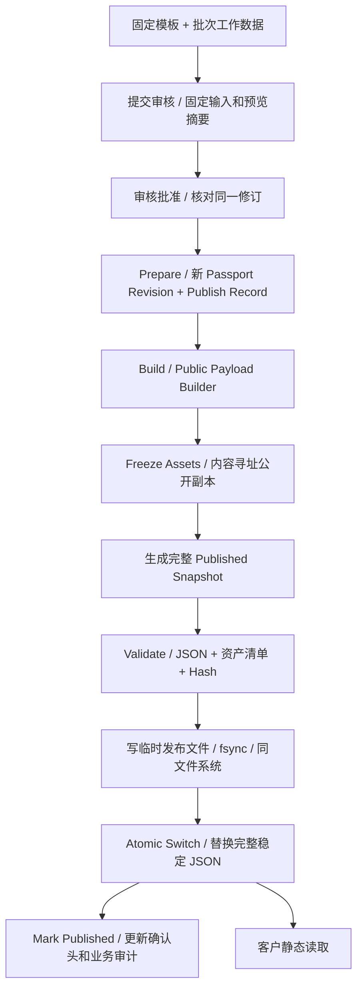

# T3 发布、回滚与资产冻结模型

> 当前 T10（2026-09-10）：T0–T9 已人工验收；版本、审计与回滚已本地实现并等待人工验收，详见本文末节及 T10_VERSION_AUDIT_ROLLBACK.md。下方早期阶段文字保留历史语境。

状态：**等待人工验收**。本文件仅设计 T9–T12 所需的模型和约束；未编写/运行 Publish Engine，未执行任何数据库或服务器操作。与 [DATA_MODEL.md](DATA_MODEL.md)、[PUBLIC_PAYLOAD_SCHEMA.md](PUBLIC_PAYLOAD_SCHEMA.md) 配套。

## 1. 三类数据与不变条件

1. Working Data：产品当前选择、草稿 Batch/Overrides/Inspection/Sections；仅通过受控编辑修改。Product Revision、已封存 Certification、media 字节是固定引用，不能悄悄换最新。
2. 审核候选：Batch 提交时保存 submitted_input、edit_version、schema/builder version、content_hash、preview_hash；没有正式公开 URL。候选文字、语言和最终公开资产处理方案必须与审核预览一致。
3. 发布内容：passport_revisions 的完整 Public Payload 与 published_assets 清单。客户只读静态文件，数据库不是公网依赖。后台替换文件、翻译或证书不改变已冻结公开副本。

产品模板先封版再允许 Batch 引用；封版包括译文、默认认证链接、模块和附件。Batch 本身有可重新编辑的工作集，历史 Passport 不引用这个工作集实时计算。



只有最后一次完整稳定 JSON 的原子替换是客户可见提交点。资产提前就绪且旧资产保留，不能原地覆盖旧图片。数据库事务和文件系统 rename 不是分布式事务，存在切换已完成而 DB 未确认的窗口；模型必须承认并恢复这个窗口。

## 2. 提交、审核与 Prepare

Editor 提交：在短事务中检查 draft、active_publish_record_id=NULL、预期 edit_version。读取固定模板及全部工作子表，解析公开意图和语言回退，构造受控的私有 submitted_input 并保存摘要；普通 HTTP 日志不保存整份内容。昂贵的私有预览/转码在提交事务前按 edit_version 预生成，短事务内重验版本和字节 Hash，避免长时间占用 SQLite 写锁。提交后主行内容与所有工作子表锁定，写 review_submitted 业务审计。

预览使用本次 Builder 版本和确定性的资产处理规则。图片元数据清理/转码、PDF 检查应在私有预览准备区完成或可确定重现，不向公网落地；preview_hash 覆盖去掉 publication 信封后的完整最终业务内容，包括内容寻址的资产路径、大小和 Hash。不能在审核后换一个未见过的文件转换结果。

T8（2026-09-09）调整：**Approve 与 Prepare 分开**。Reviewer 的批准事务只核对 current_review_record_id、候选/预览 Hash、提交版本/用户/时间/schema/builder，写不可变 Review Record 决定、Batch 审核元数据和 review_approved 审计。它不分配 Vn、不建 Passport Revision/Publish Record，不写文件。批准后派生 ready_for_publish 并保持锁定；Return to Draft 明确撤销当前批准有效性，保留历史。

以下 Prepare 为 **T9 待实现**：只有显式发布操作，核对同一有效批准、submitted_*、edit_version、源资产字节 Hash 和预览摘要后才可进入。任何变化必须回 Draft 重提，不能重新解析 Product 当前默认 Revision，也不能批准后再编辑译文。Prepare 单独事务：

- 复核并引用已经批准的 Review Record，保留原 reviewed_at/by；不重复伪造审核决定。
- 原子读取 next_version_number 分配 Vn 后递增；失败保留已分配序号，允许间断，绝不复用历史序号。
- 生成 Passport Revision，复制 submitted_input 至 frozen_input，固定 source_edit_version、source_content_hash、schema/builder、reviewed/published 用户、release_identifier。
- source_revision_id=操作前的当前正式头；第一次 NULL。正常发布 rollback_source_revision_id=NULL。
- 创建唯一 Publish Record，operation_type=publish、status=pending、expected_current_revision_id=当前头，保存幂等键。
- batches.active_publish_record_id 指向它，工作流保持 pending_review，写 publish_requested 事件。

同一 HTTP 幂等键返回同一 Record，不能重分配 Vn。一个 Batch 最多一个 active Record；普通接口不能设置这个指针。frozen_input 的私有结构版本 1 至少包含 schema/builder、batch_id/base_revision_id/edit_version、固定核心值、覆盖决策、认证版本/适用链接、检测、模块、已批准译文、资产 source ID/hash/转换规则/公开标签和审核摘要；禁止直接存 ORM 关联树或凭据。内部 ID 只在此私有快照中保留，Public Builder 不透传。

## 3. Build、资产冻结、Validate

Build 仅使用 frozen_input。授权 API 与 Builder 分离：Builder 以受控输入生成专门 Public DTO，显式列举允许字段；不使用 GORM MarshalJSON 输出整个对象。任意新 ORM 字段不会自动进入公网。

文件规则：

- Media Asset 的原文件不可原地替换。image-B/Certificate-B 是新 media ID/key；旧 media 及模板/认证链接仍然对应旧字节。
- 对需要公开的文件复核资格/类型、大小和源 Hash，按已审核转换规则处理。图片允许 JPEG/PNG/WebP；PDF 必须做类型/安全检查，默认下载方式服务，不能信任扩展名或把任意 HTML/SVG 当图公开。
- 最终字节计算 SHA-256，路径形如 `assets/sha256/ab/完整64位hash.pdf`，固定 MIME→扩展名。公开文件名不用 original_filename；公网仅暴露安全 public_label。
- 同 Hash 的公开文件允许物理去重；每个 Passport 有独立 Published Asset 行，复制不可变清单，不能为了节省行数把版本关系丢掉。已存在路径只有当大小、Hash、MIME 全匹配才复用，出现冲突立即失败，不覆盖。
- Published Assets 是独立公开存储字节副本，不是后台私有路径的符号链接。替换/disabled/purge 私有文件不触发公开删除。sealed 模板/认证或未决审核仍引用的私有源，不应清理。
- 先准备完整资产集合，再填最终 Payload 的 assets 与各处 asset_keys。asset_manifest_hash 对按 asset_key 排序的 [{key,path,mime_type,file_size,sha256,role,label}] 规范清单计算；Validate 要求 DTO 引用集合与清单相符，无缺失/重复/私有路径。

序列化约定：JSON UTF-8、无 BOM、无尾换行；键按 Unicode 码点排序，无多余空白；数组保留已验证顺序；所有精确检测/包装小数用规范字符串，公开整数限制在 JS 安全整数内，字符串不作不明 Unicode 改写。T9 为 Go 序列化器建立固定字节测试向量，不能默认不同语言编码器结果一样。payload_hash=确切文件字节 SHA-256；不把此 Hash 放进同一个 Payload 自引用。content_hash=去掉 publication 后按同规则序列化的业务内容，回滚用于比较业务不变。

Hash、JSON Schema、日期/单位/关联/资产检查全部通过后，payload/hash/path/asset_manifest_hash/sealed_at 一次写入 Passport，记录 asset_count，status=prepared。sealed 后输入、Payload、资产清单全部冻结，哪怕之后发布失败也不重新原地构建不同内容。

## 4. 临时文件与原子切换

推荐一个环境一个独立 DB/公开根；测试和生产不是同一个 Batch 表上的切换按钮。公开根由配置映射到存储，不把 `/opt`、域名或服务器 IP 写进业务数据。

```text
公开存储根（独立于后台容器生命周期）/
├── assets/sha256/ab/<hash>.jpg      # 内容寻址，仅批准公开的副本
├── versions/PF-TEST-001/v1.json    # 不可变历史 JSON
└── published/PF-TEST-001.json      # 唯一稳定入口数据，完整快照
同一文件系统、静态服务不可访问的 staging/locks/
```

版本文件和稳定文件临时副本均先写完、fsync 文件、关闭，在同文件系统 rename。不可变 versions 路径采用“不存在才创建”的保护；已存在只有 Hash 完全一致可继续，否则失败。原子替换稳定完整 JSON 前，所有新 assets 已存在且校验通过；旧 assets/版本文件保留。目录项刷盘按目标文件系统与平台验证，不能把 rename 的进程原子可见性等同断电持久化保证。

每个 Batch 的准备至确认阶段由单个受控发布执行器处理，文件切换阶段持有实际文件系统互斥锁；仅有数据库超时租约不够，因为过期旧 worker 仍可能执行 rename。新 worker 只能在旧锁释放/原进程退出后接手，不能因“超时”强占后并发切换。持锁期间核对 active record、expected_current_revision_id 与稳定文件版本/Hash；不匹配转 recovery_required，不覆盖。

先将 Record 持久化为 switching，再执行唯一稳定文件 rename。客户读到旧完整文件或新完整文件；每个文件都引用已存在的不变资产。绝不依次替换多个当前 JSON、图片造成跨版本混合。

成功后在 DB 事务一次设置 revision.published_at、record.switched_at/completed_at/published、Batch.current 指针及 workflow=published，清空 active 指针并写 publish_succeeded。I06/I08 的检查允许这个限定顺序在同一事务执行。实际 switched_at 若进程在 rename 后崩溃无法精确恢复，则记录恢复观测时间并在审计 metadata 明示 reconstructed=true，不伪造精确事故时刻；不可变 publication.issued_at 是构建签发时间，不宣称是精确公网切换时间。

## 5. 作业状态与故障矩阵

| 状态 | 含义 | 可转状态 |
| --- | --- | --- |
| pending | 已授权、已有持久冻结输入 | building / failed |
| building | 构建 DTO、冻结资产 | validating / failed |
| validating | 校验全部产物 | prepared / failed |
| prepared | Passport 已 sealed，完整产物就绪 | switching / failed |
| switching | 将要或已经原子切换，结果可能未确认 | published / recovery_required |
| recovery_required | 必须持锁对账，不能允许下一发布 | switching / published / failed（仅证实从未切换） |
| published | 此操作成功完成，终态 | 无；回滚另建 Record |
| failed | 证实未影响公开头或从未切换，终态 | 无；重新操作新键/新版本 |

不设置 rolled_back 状态：V3 后来被 V4 替代并不使 V3 当时发布失败，旧 Record 保持 published。是否为回滚由新 Record.operation_type 与新 Revision.rollback_source_revision_id 表达。

| 失败位置 | 公开端 | 恢复依据 |
| --- | --- | --- |
| Prepare 事务失败 | 旧版不变 | DB 原子回滚；无作业则无发布 |
| 构建/转换/Schema/权限/磁盘满（切换前） | 旧版及旧资产不变 | Record failed + 脱敏原因，清 active；保留已封存失败版本诊断 |
| 新资产已写、稳定 JSON 未换 | 旧版不变；新文件可能孤立 | 用未决/正式引用集合保护；孤立产物延迟 GC，不立即全局清理 |
| switching 后进程崩溃 | 可能旧也可能新，不能假定失败 | 持锁读取稳定完整 JSON，验证版本+payload_hash+全部资产 |
| 新文件已激活，DB 尚未确认 | 新版已对客生效 | 对账为同一目标→补齐 DB/审计，不另分配版本、不回滚公开文件 |
| 旧文件仍在，目标 prepared 完整 | 旧版服务 | 对账确认预期旧头→恢复同一作业切换，或在确认未切换后失败 |
| 文件既非 expected 也非 target | 保持当前文件，不自动覆盖 | recovery_required，隔离发布，人工核对本项目；不能通过停止共享 Caddy 处理 |

第一次发布尚无旧版时，失败保持“未发布/找不到记录”，不得显示半成品。“发布失败旧版继续可用”适用于已有旧版且切换前已确定失败；切换后未知不能谎报失败并让用户重发。读者可能已看到新版，此时应完成确认。真正需要退回旧内容必须走新的回滚发布流程。

## 6. 正常发布、重发和 Rollback

第一次发布：分配 V1（前提无失败占号）、source_revision_id=NULL，固定模板/批次候选构造快照，激活后 stable URL 指向 V1 内容。

正常修改重发：从 Published 显式创建新的 draft 工作轮次，修改只影响工作表，旧 V1 文件仍服务；审核后分配 V2，source_revision_id=V1。若失败消耗了版本号，后台应清楚区分“失败准备版本”与“已发布版本”，不为连续编号改写历史。

回滚例：当前 V3，Super Admin 选择已发布 V2 并确认该旧内容允许重新公开；发起一次独立的回滚授权操作并填写原因、记录审计（仅 Super Admin；保留历史审核来源，不伪造新的 Review 决定）。复制 V2 的**业务 Payload**及 Published Asset 清单，新建 V4：

- version_number=4（无其他占号时）；source_revision_id=V3。
- rollback_source_revision_id=V2；T10 实现保留目标的 source_review_record_id、source_edit_version、source_content_hash、reviewed_by/at 作为原批准链；回滚授权者记录在新 published_by/created_by，原因在 PublishRecord.rollback_reason。
- frozen_input 保留目标的原审核冻结输入以满足原批准关联不变式；T10 的实际回滚 Build 只读取经完整性验证的 V2 Published Payload 与 PublishedAsset 行，绝不重新用审核输入、当前模板或私有源文件构建。
- 新 Published Asset 清单行归 V4，可复用同内容寻址文件；若文件已损坏/丢失，必须从可信备份恢复相同 Hash 才能继续，不替换成新文件。
- Public Payload 的 product/batch/检测/认证/语言/资产等业务部分与 V2 等值；publication.version_number/issued_at/kind/source_version_number 更新为 V4 回滚信封，所以 payload_hash 通常与 V2 不同，content_hash 应相同。
- V4 用与普通发布相同 Prepare→Validate→Atomic Switch→确认流程。V1/V2/V3、原文件与 Record 全部保留，V3 不改成 rolled_back。

回滚只允许没有 draft/pending/active 操作的 Published Batch，避免静默丢弃正在编辑工作；有草稿先明确处理，不能后台代用户覆盖。回滚不自动把工作表改成 V2，避免把恢复历史公共显示误成修改工作数据；以后“编辑”界面需显示工作基线与当前公开头可能不同，并提供显式从当前公开内容建立草稿的后续功能。当前 POC 不在本轮集成。

## 7. Archive、资产删除与稳定二维码

Archive 默认只是管理归档：禁止后续编辑/发布、记录事件、保留当前及历史静态数据，因此印刷二维码不突然失效。公网撤回不是简单 Archive，涉及已缓存副本与历史 URL，若未来需要另行设计 tombstone/撤回策略，不能承诺文件删除能收回所有副本。

二维码始终指向 `/b/{batch_code}`，例如 `/b/PF260908A`。T11 静态入口由该编码读取 `published/PF260908A.json`，它本身就是当前完整 Snapshot；无需公开 API 查询 current_passport_revision_id。Vn 变更无需重新印码。历史 `versions/...` 保存完整冻结文件，后台保留版本列表；历史文件包含的也仅是允许公开字段，但是否向普通用户提供历史导航由后续前端决定，不能靠“没有链接”当访问控制。

根域名仍按已验收架构：生产 id.potahub.com、测试 id-test.potahub.com；本轮不访问业务域名、不配 DNS/SSL/服务端路由、不生成投产二维码。

文件 GC 只考虑不被任何正式版本、sealed 准备版本、未决操作或恢复保留引用的产物，必须重新扫描引用和最小保留期后受控执行；一期不提供“删除已发布资产”。私有 media 删除只允许保留元数据的 disabled/purge，不通过 FK CASCADE 影响公开资产。DB 恢复后必须对照静态清单恢复头指针，不能把较旧 DB 指针直接写回公网覆盖较新有效快照。

## 8. 后续验收场景

T9–T12 要验证：重复 HTTP 幂等；两个 worker 竞争；旧 worker 超时后续跑；批次编辑与审核并发；审核后换图/换译文；跨盘临时文件；JSON/资产校验失败；磁盘满；rename 前/后进程终止；DB 确认失败；恢复旧 DB；V3→V2 产生 V4；删除工作资产不影响 V1；后台/数据库停止后页面及 PDF/图片可读。测试只针对本项目明确实例，不操作共享服务。

本轮仅完成这些设计与文档内 Schema 静态校验，不宣称原子发布或不可变触发器已经运行通过。

## T8 已实现边界

T8 使用 review-v1 / internal-review-v1 私有候选，冻结完整批次事实、固定模板/译文、覆盖、检测及模块和翻译。候选最大 4 MiB；preview_hash 与候选原字节 SHA-256 相同，仅证明本轮内部预览输入一致。含未开放资产/认证的候选 fail closed。T3 本文的资产转换、最终公开 preview_hash 和所有 Prepare/Build/Switch 描述仍是 T9 后续设计，不能声称已验收。T9 Builder 改变内容或新增附件时必须重新审核。

## T9 实施结果（2026-09-10；等待人工验收）

T0–T8 已由用户人工验收。上文 T3/T8 的“后续设计”已由本节列出的本地实现替代；尚未部署，不代表生产可用或 T10/T11 已开放。

`service.Publishing` 使用每次请求注入的 Orm，Handler 仅做绑定/权限/响应。`publishing.Build` 完全不接收 Orm，只处理已核验的冻结审核输入，按明确白名单映射。新候选为 review-v2，包含规范化图片的审核预览字节；发布重新读取原文件、校验源 SHA、重编码并逐字节核对批准的规范化图，再写公开副本。只有当前 ready_for_publish 且当前审核指针、编辑版本、内容 Hash、输入、预览摘要、审核人及时间均一致的批次允许 Prepare。Super Admin 可发布；Reviewer 并不因此获得发布权。

实际文件布局（以独立 T9 测试目录为例）：

```text
runtime/t9/private-media/<storage_key>            私有原图
runtime/t9/releases/locks/<batch_uuid>.lock      私有 OS 排它锁
runtime/t9/releases/tmp/<record_uuid>/           私有临时 JSON/资产清单
runtime/t9/releases/manifests/<release_uuid>.json 私有发布清单
runtime/t9/publish/assets/sha256/aa/<hash>.png     不可变公开图片
runtime/t9/publish/versions/<batch_code>/vN.json   不可变完整快照
runtime/t9/publish/published/<batch_code>.json     唯一稳定 Current
```

Public/Work 根必须是同文件系统、独立绝对真实路径；拒绝根路径符号链接与相互嵌套。使用 Go `os.Root` 限定路径，拒绝符号链接组件及越界路径；不使用原始文件名生成公开路径。每批次 `flock(LOCK_EX|LOCK_NB)` 横跨 Prepare→Finalize，进程退出由内核释放；DB 活动记录锁不因进程退出消失，必须恢复对账。

Prepare 事务分配唯一单调版本号、建立 PassportRevision/PublishRecord、固定 source_review_record_id、设置 Batch.active、记录审计。Build 在事务外执行，写不可覆盖文件时采用完整临时文件 Write→Sync→Close→同目录无覆盖 Link→目录 Sync；已存在路径必须实际字节 Hash 相符才复用。封版事务一次插入 PublishedAsset、写 Payload/三个摘要并设置 sealed_at、prepared。Switch 前复验完整 JSON、Manifest、DB/文件资产清单，确认旧 Current 与 expected_current 一致；持久化 switching 后使用稳定文件同目录临时文件 fsync + Rename 原子替换 + 目录 fsync。

只有 Finalize 事务成功才设置 published_at、PublishRecord=published、Batch.current/workflow=published、清除 active 并记录成功审计。`switched_at` 采用成功确认时的观测时间，审计标记 `switched_at_reconstructed=true`，不伪称精确文件替换时刻。`publication.issued_at` 固定为构建签发时间。

切换前失败保留旧 Current、保留失败记录、清除活动锁，批准继续有效；新幂等键创建新尝试、新版本号，失败版本号不复用。完全相同幂等请求返回原记录，复用键但审核/摘要/expected_current 不一致返回冲突；部分唯一索引保证每个 ReviewRecord 最多一个成功修订。

切换后最终 DB 确认失败进入 recovery_required，保留 active，禁止新发布。Admin 调用 reconcile，重新获得 OS 锁并校验封版文件与资产：Current 等于本次 Hash 则完成原事务；Current 等于旧 Hash 且封版有效则继续原切换；未封版且证实旧 Current 未变则记录失败；未知 Hash、文件损坏或归属不符保留待对账，绝不强行覆盖。未接管仍持锁的健康 worker，无超时抢锁。

临时/孤立文件手动治理：先只读扫描非终态记录和 `releases/tmp`/Manifest 对应关系；正常活跃或待对账记录禁止清理。确认 failed、非 active、没有 Current 引用、超过建议 7 天保留期的私有 tmp，才可按精确记录 ID 在同一批次锁下删除；不提供定时自动删除。孤立 Manifest/版本文件先列报告，保留诊断；不删除任何历史成功快照或共享 CAS 图片，不按文件 mtime 推测无引用。已校验的版本文件可能在切换前就位，失败 prepared 文件仍保留，但不被 Current 引用；它们仍只含已批准的公开字段，versions 路径不是访问控制边界。

本轮不含 Published→Draft 的正式编辑流程、回滚按钮/版本比较、公开页面、生产 QR 或部署。V2/V3 验证采用明确标注的本地 fixture 开启新审核，后续 Submit/Approve/Publish 仍走真实业务服务。完整证据见 [T9_PUBLISH_ENGINE.md](T9_PUBLISH_ENGINE.md)。


## T10 已实现的版本、回滚与恢复（2026-09-10）

T0–T9 已人工验收；T10 本地验收报告见 [T10_VERSION_AUDIT_ROLLBACK.md](T10_VERSION_AUDIT_ROLLBACK.md)。前述 T3/T9 记录保留原时点范围，本节与修订后的第 6 节说明当前实现。

- RollbackRequest 必填同批成功 Published target、expected_current_revision_id、UUID v4 幂等键、1–1000 字纯文本原因。JWT/LiveIdentity/Casbin/数据范围之后 Service 再读真实启用 admin 身份；无强制忽略损坏选项。
- Prepare 新建 Revision、PublishRecord(operation_type=rollback, rollback_reason)、Release UUID、单调版本号及 active 指针，和 rollback_requested 审计同事务。source_revision_id 是操作前头，rollback_source_revision_id 是恢复内容源。已分配失败编号不复用。相同键和相同完整意图重放返回原记录，改变来源/原因/预期头返回冲突。
- Build 从目标已验证 JSON 更换 publication 信封；复制逻辑 PublishedAsset 行，复用经过字节复验的 CAS 文件。随后与普通 Publish 共用 sealBuilt → verifyPrepared → switchAndFinalize → finalize/fail。业务 content_hash 相同，完整 payload_hash 因版本与签发元数据改变而不同。
- 所有普通 Publish/Rollback/Reconcile 使用同一 OS flock。普通写入重新核对旧 DB head、静态 head、完整 Manifest 和资产。即使状态缓存显示一致也不跳过验证。并发冲突允许重试，不能以超时偷锁；没有单调成功序号复用。
- `publication_health` 持久化最近一致性观测。A `failed_old_current_safe` 为已证明的安全失败；B `file_switched_db_pending` 必须对原 operation Finalize；C `db_published_current_old` 是严重不一致；D `integrity_failure` 不得自动修复历史。另有 missing_current、unknown_current、database_inconsistent 及 prepared/switching/building 等未决类别。API 同时返回 DB 版本、静态文件匹配版本/修订 ID、文件 Hash、Manifest 版本和 active Record。
- Reconcile 每次要求原因，写 reconcile_started/completed/failed。B 复验完整新 release 后确认原记录，不新建版本；未封版且仍旧 Current 的中断可确认安全失败；已封版且仍旧 Current 的作业可完成原切换。C 只有静态 head 为已验证的较旧成功版本或缺失时，才从经验证 DB current 恢复稳定文件。未知、比 DB 更新的文件或损坏 Manifest/资产一律阻止，不覆盖未知新版，不改历史文件。
- `rollback_requested` 的 prepare/prepared 对应 rollback_started/准备阶段；rollback_failed、rollback_reconcile_required、rollback_succeeded 独立追加。正常 publish 事件保留；恢复事件单独可筛选，不改成功历史 Record 为 recovery 状态。
- 当前普通 Published→Draft 的正式改稿入口仍未增加；T10“回滚后普通发布下一版”通过本地受控 Draft fixture 后真实 Submit/Approve/Publish 验证。后台公开头与原工作集可能不同，不能把 Rollback 当工作数据编辑。
- Manifest 验证比 T9 更严格：所有字段与 DB/源审核链相等，原文字节等于确定编码，JSON/资产全部复验。最早 T9 Manifest 没有显式 version_number，其版本通过 snapshot_path 严格对应；兼容该既有字节格式，不改写历史。
- Published 历史永久保留，无 GC；资产引用数按 distinct Published Revision 动态计算。Batch 可归档 Draft 或 Published（不能 active/pending），Product 归档不删除版本、审核、发布记录或静态文件。
