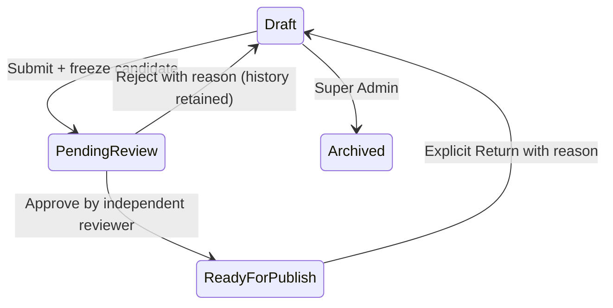

# 【T8 执行结果】

T8 状态：**等待人工验收**。T0–T7 已由用户人工验收。本轮 **50/50 Gate PASS，498 项验收断言 PASS，0 FAIL**；另 301 项前端单元测试 PASS。未进入 T9，所有 T8 本地服务已停止。

RBAC、Super Admin、Editor、Reviewer、Viewer、Submit for Review、Readiness Validation、Pending Review Lock、Reject、Approve、Self Approval Protection、Review History、Transactions、Concurrency、Audit、Casbin、UI、Browser E2E、Persistence、Fresh DB、Integrity、Baseline Protection：**PASS**。

上述 0 FAIL 指下列实际验收套件，不含“已知工具限制”中明确保留非零退出码的上游通用契约诊断。没有把未支持的静态检查标成通过。

## Roles 与 Permissions Matrix

沿用 Go Admin JWT、sys_user/sys_role/sys_menu/sys_api/sys_menu_api_rule/casbin_rule、数据权限和 admin 超级管理员行为。四类角色为 Super Admin（原 admin）、Editor、Reviewer、Viewer。新增 passport_editor_reviewer 为 Editor + Reviewer 并集：上游一个用户只有一个 role_id，没有伪造多角色表或第二套登录。角色及菜单权限由 T8 迁移产生；测试用户通过原 sys-user API 创建。

| 动作 | Super Admin | Editor | Reviewer | Viewer | Editor + Reviewer |
| --- | --- | --- | --- | --- | --- |
| 产品/批次/模块/审核详情只读 | 是 | 是 | 是 | 是 | 是 |
| 创建/修改模板、封版、默认切换、批次/模块编辑 | 是 | 是 | 否 | 否 | 是 |
| 产品停用/归档、草稿批次归档 | 是 | 否 | 否 | 否 | 否 |
| Submit / 已批准后显式 Return to Draft | 是 | 是 | 否 | 否 | 是 |
| 审核队列、Approve / Reject | 是 | 否 | 是 | 否 | 是 |
| 审核自己参与的批次 | 否 | 否 | 否 | 否 | 否 |
| 正式发布、资产冻结、回滚 | 未开放 | 未开放 | 未开放 | 未开放 | 未开放 |

所有业务路由 JWT 后重新读取当前用户/角色启用状态和角色键，再进入上游 AuthCheckRole/Casbin 和 PermissionAction。账号停用旧 JWT 为 401；由 Editor 降为 Viewer 后旧 JWT 的写请求为 403。admin 使用上游超级管理员分支，不声称其必须逐条命中 Casbin p 规则。前端菜单/按钮可见性不是安全边界；Viewer、Reviewer 表单也禁用。全部现有业务写路由逐条真实 HTTP 验证拒绝，包含 T7 14 条模块路由相关写动作。

## Workflow State Machine

Approved 不直接变 Published。保持数据库原 workflow_status=pending_review，结合当前 review_records.decision=approved 派生 ready_for_publish；批次详情、列表和审核页明确显示“审核通过 · 待发布（未发布）”。不生成 Passport Revision、Publish Record、Published Assets 或文件。Pending/Approved 的批次字段、覆盖、检测、模块和所有译文继续冻结；普通编辑接口 409，DB 触发器阻止直接内容修改。批准后需 Editor/Admin 显式 Return，理由必填，清空当前提交/审核指针；原批准历史不改，下一次提交必须重新审核。Pending 的取消通过 Reviewer 驳回完成，不开无审计撤回通道。

## Readiness Validation / Submit Rules

只接收未发布、未归档且无未决发布指针的 Draft，并匹配 expected_edit_version。校验批次码、必填生产日期/有效期及日历顺序、产品启用、固定且同产品封版 base、模板及源语言产品名确认、覆盖受控字段/值/工艺结构、动态检测十进制及上下界/日期/判断、模块类型/键/内容大小/结构/语言对齐。已有覆盖/检测翻译也检查语言、状态、文字及工艺键。公开意图且可见的自有/替换模块要求 ready 与源语言文字 approved；私有工作模块允许 draft。其他五种语言不强制齐全。

源附件引用缺失或存在尚未开放资产/认证关联时 fail closed，返回结构化错误，不省略附件后放行。API 返回 code=422 与 data.errors[code,field,message]；readiness GET 返回 ready/errors/edit_version。UI 列出具体问题，核心或模块尚未保存时禁止提交。单次候选最大 4 MiB；文字/模块上限继承 T5–T7。

## Review Candidate / Review Record / History

新增 review_records 17 列，详见 DATA_MODEL.md 的 T8 逐字段表。业务表总计 20 张/327 列，109 个触发器。新批次字段 current_review_record_id；新增 review_returned_to_draft、review_conflict 审计事件；迁移版本 1789084800000，总迁移数 13。T4–T7 历史迁移未改。

候选包含批次身份和日期/质量/备注、固定模板内容与译文、所有覆盖与翻译、所有检测与翻译、基础和批次模块、解析的有效与隐藏模块以及来源。直接保存受控内部 review-v1 JSON 的 UTF-8 字节 SHA-256；preview_hash 相同，仅表示内部预览输入一致。Reviewer 预览从该冻结输入读取，不现场拼 Product 默认模板。批准重验提交字节/hash/edit_version/schema/builder/提交人/提交时间/preview_hash 与当前审核指针。实际切换 Product 默认 R1→R2 后候选字节/Hash 不变。

每次 Submit 新增 UUID/attempt_number，pending 只有一个；Submit/Reject/Approve/Return 与 Audit 同事务。Reject 回 Draft 并保留理由；第二次提交不覆盖第一条记录。终态不可 UPDATE，所有审核不可 DELETE，冻结输入不能改。历史列表保留全部轮次的提交者/时间、审核者/时间、决定、意见和驳回理由；当前候选完整预览，旧候选完整保存在 DB，历史列表不重复传送每轮最大 4 MiB 输入。审计面板显示最近 100 条，DB 不截断历史行。

## Self Approval / Concurrency / Transactions / Audit

Service 按 Batch 创建者、历次业务编辑审计 actor、提交者组成冻结 contributors。任何命中者不能批准或驳回，包括组合角色和 Super Admin；无管理员例外。DB 同时检查 submitted_by 与 contributors，防止自审。另一个账号具有 Reviewer 权限才能处理。

SQLite WAL/FK/5 秒 busy_timeout/FULL，单连接测试配置。短事务先保留 Batch writer，再读状态/版本；决定 UPDATE WHERE decision=pending 并检查 RowsAffected=1。5 个并发批准、5 个批准/驳回混合请求、5 个重复提交各只有 1 成功，其余 409；重复批准不重写终态。Hash/attempt 不一致拒绝。未验证生产多节点或高负载。

业务成功转移与审计原子提交；分别注入 Submit/Reject/Approve 的 audit INSERT 失败，精确比对 Batch/Review/Audit 全部回滚。409 审核冲突在失败事务之外单独记 review_conflict，表示失败尝试而非成功转移。审计通过既有 batchAudit 记录 before_data/after_data 和摘要；关联 review_id、candidate_hash、轮次、意见/理由位于 after_data，系统 metadata 保存 before/after Hash。大于既有 12 KB 审计内容阈值时保留 Hash 而省略 before/after 大体；完整意见/理由仍在不可变 Review Record，不把日志当唯一业务存储。

## API 与 UI

所有新 API 在 /api/v1 下：

| 方法 | 路径 | 用途 |
| --- | --- | --- |
| GET | /passport-reviews | pending / approved 队列，分页/搜索 |
| GET | /passport-batches/:id/review | 当前候选、审核历史、审计 |
| GET | /passport-batches/:id/review/readiness | 结构化校验 |
| POST | /passport-batches/:id/review/submit | 提交并冻结 |
| POST | /passport-batches/:id/review/approve | 批准，不发布 |
| POST | /passport-batches/:id/review/reject | 必填理由驳回 |
| POST | /passport-batches/:id/review/return | 批准后撤销当前批准并改稿 |
| POST | /passport-batches/:id/review/archive | Admin 草稿归档 |

8 个 API（9401–9408）、5 个菜单/按钮（9401–9405），复用原产品数字身份证菜单。队列 /#/passport/reviews；批次 /#/passport/batches?batch=UUID 内嵌 ReviewPanel。结构化只读预览显示核心/来源、动态检测、模块、所有语言/状态，长文本自动换行，阿拉伯模块按 rtl。Approve/Reject 确认弹窗、纯文本 2000 字符限制、驳回理由必填；没有 Publish 按钮。中英文语言包齐全，未要求员工写 JSON。

## Browser E2E / Persistence / Fresh DB

真实 Chromium，所有网络请求限制 localhost；没有 Mock 响应。主库与独立空库分别通过：Editor 登录→创建 Product/确认源文字/Seal/设默认→创建 Batch/自定义模块→未保存阻止提交→Submit→Pending 表单只读→Viewer 登录确认只读→Reviewer 队列/冻结内容/Reject→Editor 修改重提→Reviewer Approve→两轮历史/未发布提示。组合角色点击批准自己的批次真实收到 403。更换账号使用独立全新浏览器上下文，避免复用上一角色缓存；不声称测试了上游退出菜单本身。

两套后端真实停止再启动，Batch/Review/Audit 全表逐行一致，API 当前候选、历史、浏览器批准结果仍一致。最后又检查修正后的模块来源翻译和 1280px 页面，无 JS 异常/缺失语言键，无页面横向溢出。

空 SQLite 与 T7 只读备份升级结构相同，全部迁移可重复；原业务字段逐行 Hash 不变。上游 GORM 创建中间表的 FK 声明次序不确定，比较时对这一个表归一化声明次序，foreign_key_check 另行全量通过，不把声明顺序误报成结构变化。最终 integrity_check=ok、FK 0 异常；审核无孤儿/无重复 pending/候选与锁定状态一致。

## 验收套件

| 套件 | PASS |
| --- | --- |
| Main API | 113 |
| Fresh API | 113 |
| Readiness and freeze edges | 26 |
| Migrations | 11 |
| Go T5-T7 regression | 106 |
| Browser workflow | 25 |
| Fresh browser workflow | 25 |
| Post-restart UI | 3 |
| Restart persistence | 14 |
| Business API contracts | 5 |
| Tooling | 6 |
| Final integrity and protection | 51 |

完整机器证据在 T8_TEST_RESULTS.json，原始日志和截图在 runtime/t8。凭据文件仅本地 0600，不在报告中输出密码。

## 文件清单

新增：

- `admin/go-admin/app/passport/models/review.go`
- `admin/go-admin/app/passport/service/dto/review.go`
- `admin/go-admin/app/passport/service/review.go`
- `admin/go-admin/app/passport/middleware/identity.go`
- `admin/go-admin/app/passport/apis/review.go`
- `admin/go-admin/app/admin/router/passport_reviews.go`
- `admin/go-admin/cmd/migrate/migration/version/1789084800000_review_workflow.go`
- `admin/go-admin/cmd/migrate/migration/version/1789084800000_review_workflow.sql`
- `admin/go-admin-ui/src/api/passport/reviews.ts`
- `admin/go-admin-ui/src/views/passport/reviews/index.vue`
- `admin/go-admin-ui/src/views/passport/reviews/ReviewPanel.vue`
- `admin/go-admin-ui/src/lang/en-US/passport/reviews.ts`
- `admin/go-admin-ui/src/lang/zh-CN/passport/reviews.ts`
- `docs/T8_RBAC_REVIEW_WORKFLOW.md`
- `docs/T8_TEST_RESULTS.json`
- `admin/t8/verify_api.py`
- `admin/t8/check_contract.py`
- `admin/t8/verify_migrations.py`
- `admin/t8/build_report.py`
- `admin/t8/verify_final.py`
- `admin/t8/setup.py`
- `admin/t8/verify_browser.cjs`
- `admin/t8/verify_ui_smoke.cjs`
- `admin/t8/verify_restart.py`
- `admin/t8/env.sh`
- `admin/t8/verify_edges.py`

修改：

- `admin/go-admin/app/passport/models/batch.go`
- `admin/go-admin/app/passport/service/batch.go`
- `admin/go-admin/app/passport/service/product.go`
- `admin/go-admin/app/admin/router/passport_products.go`
- `admin/go-admin/app/admin/router/passport_batches.go`
- `admin/go-admin/app/admin/router/passport_sections.go`
- `admin/go-admin-ui/src/api/passport/batches.ts`
- `admin/go-admin-ui/src/views/passport/products/index.vue`
- `admin/go-admin-ui/src/views/passport/batches/index.vue`
- `admin/go-admin-ui/src/lang/en-US/index.ts`
- `admin/go-admin-ui/src/lang/zh-CN/index.ts`
- `docs/DATA_MODEL.md`
- `docs/DATA_MODEL_ERD.md`
- `docs/PUBLISH_MODEL.md`
- `docs/TASKS.md`

另有本地忽略配置 .env.t8.local/.env.t8fresh.local、runtime/t8 独立测试数据库/构建/日志/截图。现有业务源在任务开始前就是未提交文件，不能把它们全部误报为 T8 新增。上游后端 tracked 修改 0；UI 仅两个 locale index 累计各 +5/-1，本轮各新增一次 review 注册。

## Known Risks / 工具限制 / T9 Boundary

- pnpm check:api 的上游静态脚本未扫描 app/passport，固定 Product→DemoProduct 别名且不能表达聚合列表，产生 4 项诊断，退出码 1 原样保留在日志。这不是已通过的检查。T8 独立 5 项 DTO 契约检查及实际端到端请求通过；未来若扩展该工具应单独维护解析范围，不能简单忽略真实字段错误。
- ESLint 0 errors、30 个原有 warnings；Go M1 CPU 依赖编译器提示为既有第三方警告。TypeScript、构建、301 unit 均通过。首次验收暴露并修正了角色种子软删除扫描、可空 reviewed_at CHECK；测试曾使用错误初始 edit_version 和确认按钮定位，已按实际系统修正并重跑。失败 T8 临时库留在独立 failed-* 目录，不覆盖历史证据。
- 审核记录 UI 列全历史元数据，当前候选完整展示；旧轮候选保存在 DB，尚无逐轮历史候选预览页面。当前候选生成在有上限的 SQLite 事务中；高并发、多节点、超大模块规模未验收。上游单 role_id 以明确组合角色解决两角色并集，不声称实现任意多角色体系。
- T8 preview_hash 不是 Public Payload Hash；资产/认证未开放的关联阻止提交，不承诺媒体管理已完成。T9 必须验证相同批准/候选版本、公开白名单、资产变换一致性，并实现独立显式发布事务；任何新增或变化内容须重新审核。
- 原 53 文件/site 7 文件/36,278 历史受保护文件 Hash 一致。未连接 SERVER_IP，未 SSH，未改 Caddy、Directus、数据库服务、生产 Docker、DNS、HTTPS；未生成公开快照、正式资产副本、QR。localhost 18101/18102/19532/19533 均已关闭并确认 ECONNREFUSED。

## 50 项 Gate

| Gate | 要求 | 结果 |
| --- | --- | --- |
| 1 | 四角色建立并可用。 | PASS |
| 2 | Editor 权限正确。 | PASS |
| 3 | Reviewer 权限正确。 | PASS |
| 4 | Viewer 只读。 | PASS |
| 5 | Super Admin 权限正确。 | PASS |
| 6 | 所有权限 Backend/Casbin 强制。 | PASS |
| 7 | Submit for Review 可用。 | PASS |
| 8 | 提交前 Readiness Validation 生效。 | PASS |
| 9 | 不合格 Batch 无法提交。 | PASS |
| 10 | Draft → Pending Review 正确。 | PASS |
| 11 | Pending Review 锁定业务数据。 | PASS |
| 12 | Reviewer 不能编辑业务内容。 | PASS |
| 13 | Reject 可用。 | PASS |
| 14 | Reject Reason 必填。 | PASS |
| 15 | Reject → Draft 正确。 | PASS |
| 16 | 再次提交产生新的审核记录。 | PASS |
| 17 | Approve 可用。 | PASS |
| 18 | Approve 后不是 Published。 | PASS |
| 19 | Approved / Ready for Publish 状态明确。 | PASS |
| 20 | Approve 后业务数据继续锁定。 | PASS |
| 21 | Self Approval 默认禁止。 | PASS |
| 22 | 角色组合不能绕过 Self Approval。 | PASS |
| 23 | Review History 完整保留。 | PASS |
| 24 | Audit 完整产生。 | PASS |
| 25 | Audit 与业务状态变更同事务。 | PASS |
| 26 | Submit 事务失败完整回滚。 | PASS |
| 27 | Reject 事务失败完整回滚。 | PASS |
| 28 | Approve 事务失败完整回滚。 | PASS |
| 29 | 并发 Approve 只有一个成功。 | PASS |
| 30 | Approve/Reject 竞态只有一个成功。 | PASS |
| 31 | 重复 Submit 不产生重复有效审核。 | PASS |
| 32 | Pending Review 时 Product Default 变化不影响审核内容。 | PASS |
| 33 | Pending Review 时 Batch 内容不可修改。 | PASS |
| 34 | Viewer 写操作全部拒绝。 | PASS |
| 35 | Editor Approve/Reject 全部拒绝。 | PASS |
| 36 | Reviewer 普通业务编辑拒绝。 | PASS |
| 37 | 所有新 API 认证。 | PASS |
| 38 | 所有新 API 经过 Casbin。 | PASS |
| 39 | 浏览器完整 Editor→Reviewer 流程通过。 | PASS |
| 40 | Self Approval 浏览器测试通过。 | PASS |
| 41 | Backend 重启后审核状态和历史保持。 | PASS |
| 42 | Fresh DB 从零建立。 | PASS |
| 43 | Migration 重复执行安全。 | PASS |
| 44 | integrity_check = ok。 | PASS |
| 45 | foreign_key_check 无异常。 | PASS |
| 46 | 原 53 个基线文件不变。 | PASS |
| 47 | site 7 个文件不变。 | PASS |
| 48 | 未生成 Published Snapshot。 | PASS |
| 49 | 未冻结正式 Published Assets。 | PASS |
| 50 | 未进入 T9。 | PASS |

## 75 项逐项回答

| 序号 | 问题 | 回答 |
| --- | --- | --- |
| 1 | 是否实现 Super Admin？ | 是；已实现并有本轮本地验收证据。 |
| 2 | 是否实现 Editor？ | 是；已实现并有本轮本地验收证据。 |
| 3 | 是否实现 Reviewer？ | 是；已实现并有本轮本地验收证据。 |
| 4 | 是否实现 Viewer？ | 是；已实现并有本轮本地验收证据。 |
| 5 | Viewer 是否真正只读？ | 是；已实现并有本轮本地验收证据。 |
| 6 | Editor 是否不能 Approve？ | 是；已实现并有本轮本地验收证据。 |
| 7 | Editor 是否不能 Reject？ | 是；已实现并有本轮本地验收证据。 |
| 8 | Reviewer 是否不能修改业务数据？ | 是；已实现并有本轮本地验收证据。 |
| 9 | 是否全部通过 Casbin 强制？ | 是；业务路由统一 JWT → LiveIdentity → 上游 AuthCheckRole/Casbin → PermissionAction；admin 保留上游超级管理员规则。 |
| 10 | 是否存在前端隐藏但后端可绕过的权限？ | 未发现；全部业务写路由逐条实测权限拒绝，普通员工表单也禁用。 |
| 11 | Submit for Review 是否可用？ | 是；已实现并有本轮本地验收证据。 |
| 12 | 是否存在 Readiness Validation？ | 是；已实现并有本轮本地验收证据。 |
| 13 | 不完整数据是否被拒绝提交？ | 是；已实现并有本轮本地验收证据。 |
| 14 | Draft 是否正确进入 Pending Review？ | 是；已实现并有本轮本地验收证据。 |
| 15 | Pending Review 是否锁定 Batch？ | 是；已实现并有本轮本地验收证据。 |
| 16 | Pending Review 是否锁定 Override？ | 是；已实现并有本轮本地验收证据。 |
| 17 | Pending Review 是否锁定 Inspection？ | 是；已实现并有本轮本地验收证据。 |
| 18 | Pending Review 是否锁定 Custom Sections？ | 是；包括模块本体及译文，API/DB 双重锁定。 |
| 19 | Reject 是否可用？ | 是；已实现并有本轮本地验收证据。 |
| 20 | Reject Reason 是否必填？ | 是；已实现并有本轮本地验收证据。 |
| 21 | Reject 后是否回 Draft？ | 是；已实现并有本轮本地验收证据。 |
| 22 | Reject 历史是否保留？ | 是；已实现并有本轮本地验收证据。 |
| 23 | 是否可以再次 Submit？ | 是；已实现并有本轮本地验收证据。 |
| 24 | 第二次审核是否不会覆盖第一次记录？ | 是；已实现并有本轮本地验收证据。 |
| 25 | Approve 是否可用？ | 是；已实现并有本轮本地验收证据。 |
| 26 | Approve 后是否不会直接变 Published？ | 是；只到 ready_for_publish，未建立公开版本或发布记录。 |
| 27 | 是否存在 Approved / Ready for Publish 等明确状态？ | 是；pending_review + 当前审核 approved 派生 ready_for_publish，不改旧枚举。 |
| 28 | Approved 后是否锁定？ | 是；已实现并有本轮本地验收证据。 |
| 29 | 是否禁止 Self Approval？ | 是；已实现并有本轮本地验收证据。 |
| 30 | Editor+Reviewer 同一用户是否仍不能审核自己？ | 是；上游单角色 ID 下以 Editor + Reviewer 组合角色实现权限并集，Service/DB 仍禁止自审。 |
| 31 | 如实现 Super Admin Override，是否强制理由和 Audit？ | 未实现 Override；Super Admin 同样不能自审，因此无例外理由入口。 |
| 32 | 是否存在 Review Record / Review Attempt？ | 是；已实现并有本轮本地验收证据。 |
| 33 | 是否与 Publish Record 分离？ | 是；已实现并有本轮本地验收证据。 |
| 34 | 是否保留完整 Review History？ | 是；每轮独立存储并保留决定、意见、理由、用户和时间；UI 列出所有轮次。 |
| 35 | 是否保存 submitted_by？ | 是；已实现并有本轮本地验收证据。 |
| 36 | 是否保存 submitted_at？ | 是；已实现并有本轮本地验收证据。 |
| 37 | 是否保存 reviewed_by？ | 是；已实现并有本轮本地验收证据。 |
| 38 | 是否保存 reviewed_at？ | 是；已实现并有本轮本地验收证据。 |
| 39 | 是否保存 rejection_reason？ | 是；已实现并有本轮本地验收证据。 |
| 40 | 是否存在 Review Candidate Hash 或等价冻结机制？ | 是；冻结受控 review-v1 输入及 SHA-256，内部 preview_hash 相同。 |
| 41 | Reviewer 看到的数据是否与提交时一致？ | 是；已实现并有本轮本地验收证据。 |
| 42 | Product Default 改变是否不影响待审核内容？ | 是；固定 base_revision_id 和候选字节，不读取新的默认模板。 |
| 43 | 并发 Approve 是否只有一个成功？ | 是；5 个并发批准仅 1 成功，其余 409。 |
| 44 | Approve/Reject 竞态是否只有一个成功？ | 是；5 个批准/驳回混合请求仅 1 成功。 |
| 45 | 重复 Submit 是否安全？ | 是；5 个并发提交仅 1 成功。 |
| 46 | 重复 Approve 是否安全？ | 是；重复批准 409，保留冲突审计。 |
| 47 | Submit 是否 Transaction？ | 是；已实现并有本轮本地验收证据。 |
| 48 | Reject 是否 Transaction？ | 是；已实现并有本轮本地验收证据。 |
| 49 | Approve 是否 Transaction？ | 是；已实现并有本轮本地验收证据。 |
| 50 | Audit 是否与业务事务一致？ | 是；业务转移与审计同事务，注入审计失败精确回滚；409 冲突另记失败尝试事件。 |
| 51 | Viewer 写 API 是否全部拒绝？ | 是；已实现并有本轮本地验收证据。 |
| 52 | Editor 审核 API 是否拒绝？ | 是；已实现并有本轮本地验收证据。 |
| 53 | Reviewer 编辑 API 是否拒绝？ | 是；已实现并有本轮本地验收证据。 |
| 54 | 匿名是否无法访问？ | 是；已实现并有本轮本地验收证据。 |
| 55 | 浏览器 Editor→Reject→修改→再次 Submit→Approve 是否通过？ | 是；主库与 Fresh DB 均通过真实 Chromium 完整操作。 |
| 56 | Self Approval 浏览器测试是否通过？ | 是；组合角色实际点击批准收到 403。 |
| 57 | Backend 重启后状态是否保持？ | 是；两库批次、审核、审计逐行不变，API 历史及浏览器批准状态一致。 |
| 58 | Fresh DB 是否通过？ | 是；从空库跑全量迁移、真实用户/产品/封版/批次/审核/API/浏览器。 |
| 59 | Migration 是否重复安全？ | 是；空库、T7 升级和重复执行通过。 |
| 60 | integrity_check 是否 ok？ | 是；已实现并有本轮本地验收证据。 |
| 61 | foreign_key_check 是否无异常？ | 是；已实现并有本轮本地验收证据。 |
| 62 | DATA_MODEL 是否变化？ | 是；新增 review_records、批次当前审核指针及两个审计事件，校准内部预览摘要和批准/发布分离。 |
| 63 | 如变化是否新增 Migration？ | 是；1789084800000_review_workflow.go/.sql。 |
| 64 | 是否修改 T4/T5/T6/T7 历史 Migration？ | 否；T4–T7 历史 Migration Hash 均不变。 |
| 65 | 是否修改上游 tracked files？ | 是；仅前端两个语言入口存在 tracked 变化，后端 0。 |
| 66 | 如修改，具体哪些？ | src/lang/en-US/index.ts、src/lang/zh-CN/index.ts；本轮各新增一处 passportReview 注册，累计相对上游各 +5/-1。 |
| 67 | 原 53 个基线文件 Hash 是否一致？ | 是；53 个文件 Hash 全部一致。 |
| 68 | site 7 文件是否未变？ | 是；site 7 个文件 Hash 全部一致。 |
| 69 | 是否连接服务器？ | 否；仅 localhost 验收，未连接业务服务器。 |
| 70 | 是否修改 Caddy？ | 否。 |
| 71 | 是否修改 Directus？ | 否。 |
| 72 | 是否修改生产 Docker？ | 否。 |
| 73 | 是否生成 Published JSON Snapshot？ | 否；passport_revisions/publish_records/published_assets 为 0。 |
| 74 | 是否实现正式 Published Assets Freeze？ | 否；正式资产冻结仍属 T9。 |
| 75 | 是否进入 T9？ | 否；已停止，等待 T8 人工验收。 |

T8 RBAC 与审核发布工作流已完成，当前已停止，等待人工验收，未进入 T9。
